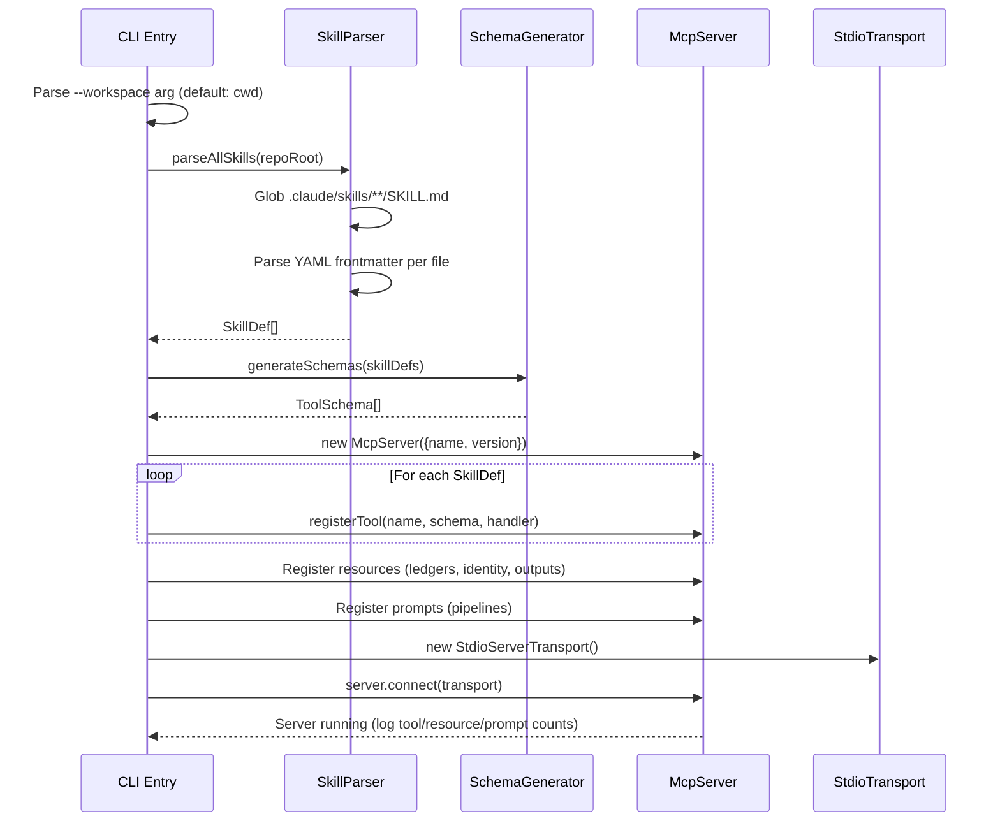
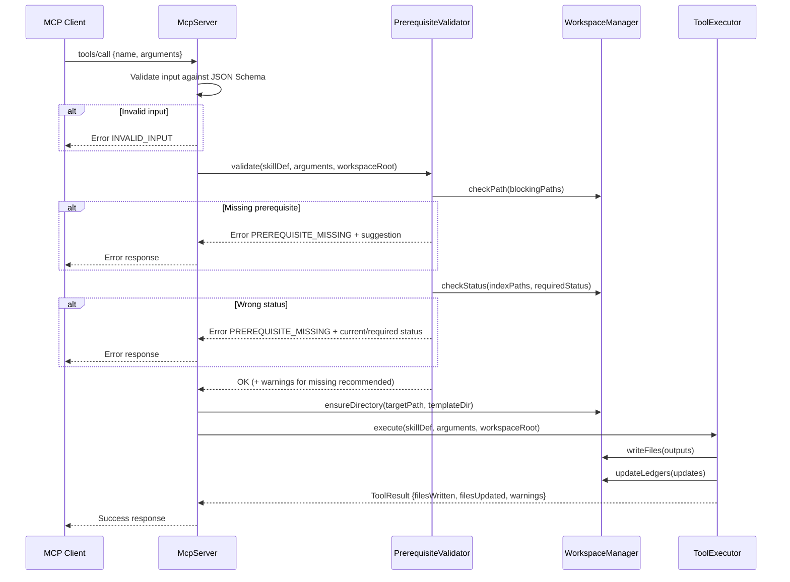
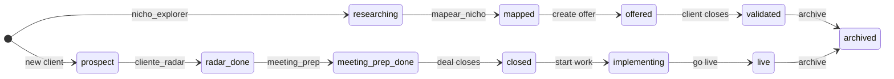

# Design Document: a360-mcp-server

## Overview

The a360-mcp-server is a TypeScript MCP (Model Context Protocol) server that wraps the 8 Accelera 360 framework-lite skills into programmatically callable tools. It lives in `mcp-server/` inside the existing monorepo and uses the official `@modelcontextprotocol/sdk` package with stdio transport.

The server reads SKILL.md files at startup to auto-discover skills and build a tool registry. Each skill becomes one MCP tool with a generated JSON Schema for inputs. Before executing any tool, the server validates blocking prerequisites against the workspace filesystem. Workspace state (ledgers, outputs, identity) is exposed as MCP resources, and pre-built pipelines are exposed as MCP prompts.

The design prioritizes:
- **Zero duplication**: SKILL.md files are the single source of truth for tool metadata.
- **Fail-fast validation**: Prerequisites are checked before execution, returning actionable error messages.
- **Canonical path compliance**: All file operations respect the WORKSPACE.md conventions.
- **Minimal footprint**: stdio transport, no HTTP server, no external dependencies beyond the MCP SDK and a YAML parser.

## Architecture

```mermaid
graph TB
    subgraph "MCP Client"
        C[Any MCP-compatible client]
    end

    subgraph "mcp-server/ process"
        CLI[CLI Entry Point<br/>bin/a360-mcp.ts]
        STDIO[StdioServerTransport]
        MCP[McpServer Instance]

        subgraph "Registries"
            TR[ToolRegistry]
            RR[ResourceRegistry]
            PR[PromptRegistry]
        end

        subgraph "Core Modules"
            SP[SkillParser]
            SG[SchemaGenerator]
            PV[PrerequisiteValidator]
            WS[WorkspaceManager]
            TE[ToolExecutor]
        end
    end

    subgraph "Filesystem"
        SKILLS[".claude/skills/**/SKILL.md"]
        WORKSPACE["Workspace root<br/>(nichos/, clientes/, ofertas/, memory/)"]
        IDENTITY["identidade.json"]
    end

    C <-->|stdio JSON-RPC| STDIO
    STDIO <--> MCP
    MCP --> TR
    MCP --> RR
    MCP --> PR

    CLI --> MCP
    CLI --> STDIO

    SP -->|reads at startup| SKILLS
    SP -->|parsed SkillDef[]| TR
    SG -->|generates inputSchema| TR
    TR -->|on tool call| PV
    PV -->|checks paths| WORKSPACE
    PV -->|passes| TE
    TE -->|reads/writes| WORKSPACE
    RR -->|reads| WORKSPACE
    RR -->|reads| IDENTITY
    PR -->|chains tools| TE
```

### Startup Sequence



### Tool Invocation Flow



## Components and Interfaces

### Module Structure

```
mcp-server/
├── package.json
├── tsconfig.json
├── bin/
│   └── a360-mcp.ts              # CLI entry point (shebang, arg parsing)
├── src/
│   ├── index.ts                  # McpServer setup, registration, connect
│   ├── types.ts                  # Shared TypeScript interfaces
│   ├── skill-parser.ts           # SKILL.md discovery and YAML parsing
│   ├── schema-generator.ts       # JSON Schema generation from SkillDef
│   ├── prerequisite-validator.ts # Blocking/recommended prerequisite checks
│   ├── workspace-manager.ts      # Path resolution, dir creation, file I/O
│   ├── tool-executor.ts          # Tool execution orchestration
│   ├── resource-registry.ts      # MCP resource registration
│   ├── prompt-registry.ts        # MCP prompt (pipeline) registration
│   ├── error-codes.ts            # Error code constants and factory
│   └── slug-utils.ts             # Slug validation and normalization
└── __tests__/
    ├── skill-parser.test.ts
    ├── schema-generator.test.ts
    ├── prerequisite-validator.test.ts
    ├── workspace-manager.test.ts
    ├── slug-utils.test.ts
    └── tool-executor.test.ts
```

### Key Interfaces

#### `SkillDef` — Parsed SKILL.md representation

```typescript
interface SkillDef {
  name: string;                    // e.g. "nicho-explorer"
  description: string;             // Human-readable description
  argumentHint: string;            // Free-text hint for the user
  allowedTools: string[];          // e.g. ["WebSearch", "Read", "Write"]
  requires: {
    blocking: string[];            // Paths/conditions that must exist
    recommended: string[];         // Paths that improve output quality
  };
  writesTo: string[];              // Canonical output paths
  updatesIndex: string[];          // Index files updated after execution
  sourceFile: string;              // Absolute path to the SKILL.md
}
```

#### `ToolSchema` — Generated input schema for a tool

```typescript
interface ToolSchema {
  name: string;                    // MCP tool name (kebab-case)
  description: string;             // From SkillDef.description
  inputSchema: JSONSchema7;        // Generated JSON Schema
}
```

#### `ToolResult` — Structured response from tool execution

```typescript
interface ToolResult {
  filesWritten: string[];          // Paths created/overwritten
  filesUpdated: string[];          // Paths modified (ledgers, indexes)
  warnings: string[];              // Non-blocking issues (missing recommended prereqs)
  metadata?: Record<string, unknown>; // Skill-specific data (scores, verdicts)
}
```

#### `PrerequisiteCheckResult` — Validation outcome

```typescript
interface PrerequisiteCheckResult {
  satisfied: boolean;
  missingBlocking: MissingPrerequisite[];
  missingRecommended: MissingPrerequisite[];
}

interface MissingPrerequisite {
  path: string;                    // The path that was expected
  reason: string;                  // Why it's needed
  suggestedTool: string;           // Which tool to run first
  currentStatus?: string;          // If status check failed
  requiredStatus?: string;         // What status was expected
}
```

#### `ErrorResponse` — Structured error

```typescript
interface ErrorResponse {
  code: ErrorCode;
  message: string;                 // PT-BR human-readable
  details?: MissingPrerequisite[] | Record<string, unknown>;
}

type ErrorCode =
  | 'PREREQUISITE_MISSING'
  | 'INVALID_INPUT'
  | 'WORKSPACE_ERROR'
  | 'EXECUTION_ERROR';
```

### Component Responsibilities

| Component | Responsibility |
|---|---|
| `bin/a360-mcp.ts` | Parse CLI args (`--workspace`), bootstrap server, connect transport |
| `skill-parser.ts` | Discover SKILL.md files, parse YAML frontmatter, return `SkillDef[]` |
| `schema-generator.ts` | Map each `SkillDef` to a JSON Schema `inputSchema` based on skill name, `requires`, and `argument-hint` |
| `prerequisite-validator.ts` | Check blocking/recommended paths against workspace, parse `_index.md` frontmatter for status checks |
| `workspace-manager.ts` | Resolve canonical paths, create directories from `_modelo/` templates, read/write files, validate slugs |
| `tool-executor.ts` | Orchestrate: validate → ensure dirs → delegate to skill-specific logic → collect results |
| `resource-registry.ts` | Register MCP resources for ledgers, identity, and generated outputs |
| `prompt-registry.ts` | Register MCP prompts for the 5 pre-built pipelines, chain tool calls in sequence |
| `error-codes.ts` | Error code constants, factory functions for consistent error creation |
| `slug-utils.ts` | Validate kebab-case slugs, normalize strings to slugs |

### Skill-to-Tool Mapping

Each of the 8 skills maps to one MCP tool. The schema generator uses the skill name to determine which parameters to include:

| Skill | Tool Name | Required Params | Optional Params |
|---|---|---|---|
| `nicho-explorer` | `nicho_explorer` | `mode` (enum: A, B), `nichoSlug` (mode B only) | — |
| `mapear-nicho-lite` | `mapear_nicho` | `nichoSlug`, `nichoDescription` | — |
| `cliente-radar` | `cliente_radar` | `companyName`, `clienteSlug` | `sector`, `websiteUrl`, `decisionMakerName` |
| `lp-builder` | `lp_builder` | `mode` (enum: oferta, cliente), slug per mode | `angle` (enum: DOR, OPORTUNIDADE, SISTEMA), `referenceUrl` |
| `gtm-architect` | `gtm_architect` | `mode` (enum: outbound, content, combo), scope + slug | — |
| `playbook-vendas` | `playbook_vendas` | `mode` (enum: oferta, cliente), slug per mode | — |
| `meeting-prep` | `meeting_prep` | `clienteSlug` | — |
| `pitch-deck-builder` | `pitch_deck_builder` | scope + slug | `renderMode` (enum: reveal, gemini, markdown-only; default: reveal) |

**Note on slug parameters:** Tools that operate on a niche include `nichoSlug`. Tools that operate on a client include `clienteSlug`. Tools that operate on an offer include `ofertaSlug`. Some tools (lp_builder, gtm_architect, playbook_vendas, pitch_deck_builder) accept a `scope` parameter (enum: oferta, cliente) that determines which slug is required.

### MCP Resources

| URI | Source File | Description |
|---|---|---|
| `a360://ledgers/nichos-mapeados` | `memory/shared/nichos-mapeados.md` | Mapped niches ledger |
| `a360://ledgers/clientes-ativos` | `memory/shared/clientes-ativos.md` | Active clients ledger |
| `a360://ledgers/ofertas` | `memory/shared/ofertas.md` | Offers ledger |
| `a360://config/identidade` | `identidade.json` | Visual identity / design system |
| `a360://outputs/{scope}/{slug}/{artifact}` | `{scope}/{slug}/{artifact}` | Generated outputs (LPs, decks, briefings) |

The output resource uses a `ResourceTemplate` to match dynamic URIs. The `scope` is one of `nichos`, `clientes`, `ofertas`. The `artifact` maps to specific files (e.g., `lp/lp.html`, `deck/deck.html`, `01-meeting-prep.md`).

### MCP Prompts (Pipelines)

| Prompt Name | Tool Sequence | Required Args |
|---|---|---|
| `prospect-meeting` | `cliente_radar` → `mapear_nicho` → `pitch_deck_builder` → `meeting_prep` | `companyName`, `clienteSlug`, `nichoSlug` |
| `business-foundation` | `nicho_explorer` (B) → `mapear_nicho` → `gtm_architect` (combo) → `lp_builder` | `nichoSlug`, `nichoDescription` |
| `client-deliverable` | `cliente_radar` → `mapear_nicho` → `lp_builder` → `pitch_deck_builder` | `companyName`, `clienteSlug`, `nichoSlug` |
| `niche-discovery` | `nicho_explorer` (A) → `mapear_nicho` | `nichoSlug` (for step 2) |
| `quick-pitch-deck` | `mapear_nicho` → `pitch_deck_builder` | `nichoSlug` |

Pipeline execution passes context from each tool's output to the next tool's input. If a tool fails, the pipeline stops and returns the error plus any results from previously completed tools.

## Data Models

### SKILL.md Frontmatter Schema (YAML)

The YAML frontmatter in each SKILL.md follows this structure:

```yaml
name: string                       # kebab-case skill identifier
description: string                # Human-readable, 1-2 sentences
argument-hint: string              # Free-text usage hint
allowed-tools: string[]            # Claude Code tool names (not used by MCP server)
requires:
  blocking: string[]               # Paths/conditions that must exist
  recommended: string[]            # Paths that improve quality
writes_to: string[]                # Output paths (with inline comments)
updates_index: string[]            # Index files updated
```

### Workspace State Model

The server reads and writes to the canonical workspace structure. Key state transitions tracked via `_index.md` frontmatter:



### Ledger Format

Ledgers in `memory/shared/` are markdown files with YAML frontmatter and a markdown table:

```typescript
interface LedgerEntry {
  slug: string;
  sector?: string;           // nichos only
  company?: string;          // clientes only
  status: string;            // State machine value
  mappedDate?: string;       // ISO date
  mechanism?: string;        // nichos only
  nextStep: string;          // Suggested action
}
```

### Tool Input Schemas (Generated)

Each tool gets a JSON Schema generated from its `SkillDef`. Example for `nicho_explorer`:

```json
{
  "type": "object",
  "properties": {
    "mode": {
      "type": "string",
      "enum": ["A", "B"],
      "description": "Mode A: Top 10 niches. Mode B: Validate specific niche (GO/NO-GO)."
    },
    "nichoSlug": {
      "type": "string",
      "pattern": "^[a-z0-9]+(-[a-z0-9]+)*$",
      "description": "Kebab-case niche slug (required for mode B)."
    },
    "userProfile": {
      "type": "string",
      "description": "User profile description for ranking (mode A)."
    }
  },
  "required": ["mode"],
  "if": { "properties": { "mode": { "const": "B" } } },
  "then": { "required": ["nichoSlug"] }
}
```

### Error Response Format

```typescript
// MCP tool error response structure
{
  content: [{
    type: 'text',
    text: JSON.stringify({
      code: 'PREREQUISITE_MISSING',
      message: 'Pré-requisito ausente: nichos/{slug}/_index.md com status=mapped não encontrado.',
      details: [{
        path: 'nichos/clinicas-derma-sp/_index.md',
        reason: 'Nicho precisa estar mapeado antes de gerar LP.',
        suggestedTool: 'mapear_nicho',
        currentStatus: 'researching',
        requiredStatus: 'mapped'
      }]
    })
  }],
  isError: true
}
```

## Correctness Properties

*A property is a characteristic or behavior that should hold true across all valid executions of a system — essentially, a formal statement about what the system should do. Properties serve as the bridge between human-readable specifications and machine-verifiable correctness guarantees.*

### Property 1: YAML frontmatter round-trip

*For any* valid `SkillDef` object, serializing it to YAML frontmatter and then parsing the result back SHALL produce a `SkillDef` that is deeply equal to the original.

**Validates: Requirements 2.1, 2.4, 2.5**

### Property 2: Parser resilience and tool count invariant

*For any* set of N files with valid YAML frontmatter and M files with malformed YAML, the skill parser SHALL return exactly N parsed `SkillDef` objects and M warning entries (each containing the file path of the malformed file).

**Validates: Requirements 2.2, 2.3**

### Property 3: Generated schemas are valid JSON Schema

*For any* valid `SkillDef`, the schema generator SHALL produce an output that is a valid JSON Schema (Draft 7) object with a `type: "object"` root and a `properties` map.

**Validates: Requirements 3.1**

### Property 4: Scope-based slug parameter inclusion

*For any* `SkillDef` whose `requires` or `writesTo` paths contain `nichos/{slug}/`, the generated input schema SHALL include a required `nichoSlug` string property. Likewise, for paths containing `clientes/{slug}/`, the schema SHALL include a required `clienteSlug` property, and for `ofertas/{slug}/`, a required `ofertaSlug` property.

**Validates: Requirements 3.2, 3.3**

### Property 5: Prerequisite validation completeness

*For any* `SkillDef` with blocking prerequisites and *any* workspace state, the prerequisite validator SHALL report every blocking path that is missing or has a non-matching status. When all blocking paths exist with matching statuses, the validator SHALL return `satisfied: true`.

**Validates: Requirements 4.1, 4.2, 4.3, 4.4, 4.5**

### Property 6: Recommended prerequisite warnings

*For any* `SkillDef` with recommended prerequisites and *any* workspace state where some recommended paths are missing, the prerequisite validator SHALL include exactly one warning per missing recommended path, and zero warnings for recommended paths that exist.

**Validates: Requirements 4.6**

### Property 7: Slug validation

*For any* string, the slug validator SHALL accept it if and only if it matches the pattern `^[a-z0-9]+(-[a-z0-9]+)*$` (lowercase alphanumeric segments separated by single hyphens, no leading/trailing hyphens, no accented characters).

**Validates: Requirements 15.5, 15.6**

### Property 8: Path resolution relative to workspace root

*For any* workspace root path and *any* canonical relative path, the resolved absolute path SHALL start with the workspace root and SHALL not contain `..` segments that escape the workspace boundary.

**Validates: Requirements 15.1**

### Property 9: Directory creation from template

*For any* valid slug and *any* scope (nichos, clientes, ofertas), when the target directory `{scope}/{slug}/` does not exist and `{scope}/_modelo/` does exist, the workspace manager SHALL create `{scope}/{slug}/` containing the same file structure as `{scope}/_modelo/`.

**Validates: Requirements 15.2, 15.3, 15.4**

### Property 10: Output resource URI resolution

*For any* valid scope (nichos, clientes, ofertas), valid slug, and valid artifact path, the URI `a360://outputs/{scope}/{slug}/{artifact}` SHALL resolve to the filesystem path `{workspaceRoot}/{scope}/{slug}/{artifact}`.

**Validates: Requirements 13.6**

### Property 11: Pipeline context passing

*For any* pipeline of N tools where all tools succeed, the Nth tool SHALL receive as input context the accumulated outputs of tools 1 through N-1.

**Validates: Requirements 14.6**

### Property 12: Pipeline partial failure

*For any* pipeline of N tools where tool K (1 ≤ K ≤ N) fails, the pipeline result SHALL contain the successful results of tools 1 through K-1 and the error from tool K, with no results from tools K+1 through N.

**Validates: Requirements 14.7**

### Property 13: Response structure invariant

*For any* successful tool execution, the response SHALL contain `filesWritten` (array), `filesUpdated` (array), and `warnings` (array) fields. *For any* failed tool execution, the response SHALL contain a `code` field matching one of the defined error codes and a non-empty `message` field.

**Validates: Requirements 17.1, 17.2, 17.4**

### Property 14: Error sanitization

*For any* unexpected error thrown during tool execution (with arbitrary message and stack trace content), the error response returned to the MCP client SHALL NOT contain the original stack trace, internal file paths, or raw error message. It SHALL contain only the generic error code `EXECUTION_ERROR` and a safe PT-BR message.

**Validates: Requirements 17.3**

## Error Handling

### Error Classification

| Error Code | Trigger | HTTP-like Analogy | Recovery Action |
|---|---|---|---|
| `PREREQUISITE_MISSING` | Blocking path absent or wrong status | 412 Precondition Failed | Run suggested tool first |
| `INVALID_INPUT` | Input fails JSON Schema validation or slug is malformed | 400 Bad Request | Fix input parameters |
| `WORKSPACE_ERROR` | Filesystem read/write failure, missing `_modelo/` template | 500 Internal | Check workspace structure |
| `EXECUTION_ERROR` | Unexpected error during skill execution | 500 Internal | Retry or report bug |

### Error Response Strategy

1. **Input validation errors** are caught at the MCP SDK level (JSON Schema validation) and by the slug validator before any filesystem access occurs.

2. **Prerequisite errors** are caught by `PrerequisiteValidator` before tool execution begins. The error response includes:
   - Each missing path with its purpose
   - The suggested tool to run to produce the missing artifact
   - For status mismatches: current status, required status, and the tool that advances the status

3. **Workspace errors** (permission denied, disk full, missing `_modelo/` template) are caught by `WorkspaceManager` and wrapped in a `WORKSPACE_ERROR` with the filesystem error message (sanitized to remove absolute paths outside the workspace).

4. **Execution errors** are caught by a top-level try/catch in `ToolExecutor`. The original error is logged to stderr with full stack trace for debugging. The client receives only a generic message: *"Erro inesperado durante execução da skill {name}. Verifique os logs do servidor."*

### Pipeline Error Handling

When a tool in a pipeline fails:
1. The pipeline executor stops immediately (no subsequent tools run).
2. The response includes `completedSteps` with results from tools that succeeded.
3. The response includes `failedStep` with the tool name and error details.
4. The client can inspect partial results and decide whether to retry the failed step or abort.

### Logging

All errors are logged to stderr (not stdout, which is reserved for MCP JSON-RPC):
- `WARNING`: Malformed SKILL.md skipped, missing recommended prerequisite
- `ERROR`: Prerequisite check failed, workspace I/O error
- `FATAL`: Skills directory not found, transport connection failure

## Testing Strategy

### Dual Testing Approach

The testing strategy combines **property-based tests** for core logic modules and **example-based tests** for integration points and specific behaviors.

### Property-Based Testing

**Library:** [fast-check](https://github.com/dubzzz/fast-check) (TypeScript-native, well-maintained, integrates with Vitest)

**Configuration:**
- Minimum 100 iterations per property test
- Each property test references its design document property via tag comment

**Tag format:** `// Feature: a360-mcp-server, Property {N}: {title}`

**Properties to implement:**

| Property | Module Under Test | Generator Strategy |
|---|---|---|
| 1: YAML round-trip | `skill-parser.ts` | Generate random `SkillDef` objects with varying field lengths, array sizes, special characters |
| 2: Parser resilience | `skill-parser.ts` | Generate mixed sets of valid YAML + random malformed strings |
| 3: Valid JSON Schema | `schema-generator.ts` | Generate random `SkillDef` objects, validate output with `ajv` |
| 4: Scope slug inclusion | `schema-generator.ts` | Generate `SkillDef` with random paths containing `nichos/`, `clientes/`, `ofertas/` |
| 5: Prerequisite validation | `prerequisite-validator.ts` | Generate random blocking paths + workspace file trees |
| 6: Recommended warnings | `prerequisite-validator.ts` | Generate random recommended paths + workspace states |
| 7: Slug validation | `slug-utils.ts` | Generate random strings (ASCII, Unicode, with/without hyphens, accents) |
| 8: Path resolution | `workspace-manager.ts` | Generate random workspace roots + relative paths (including `..` attempts) |
| 9: Dir from template | `workspace-manager.ts` | Generate random slugs + mock `_modelo/` structures |
| 10: URI resolution | `resource-registry.ts` | Generate random scope/slug/artifact triples |
| 11: Pipeline context | `prompt-registry.ts` | Generate random pipeline lengths + mock tool outputs |
| 12: Pipeline failure | `prompt-registry.ts` | Generate random pipeline lengths + failure positions |
| 13: Response structure | `tool-executor.ts` | Generate random `ToolResult` and `ErrorResponse` objects |
| 14: Error sanitization | `tool-executor.ts` | Generate random Error objects with paths, stack traces, secrets |

### Example-Based Unit Tests

| Area | Tests |
|---|---|
| CLI argument parsing | `--workspace` with valid path, missing arg defaults to cwd, invalid path |
| Skill discovery | Finds SKILL.md at various depths, ignores non-skill directories |
| Schema generation (modes) | `nicho_explorer` mode A/B, `lp_builder` oferta/cliente, `pitch_deck_builder` renderMode |
| Resource registration | 3 ledgers + identity registered with correct URIs |
| Prompt registration | 5 pipelines registered with correct tool sequences |
| Error codes | Factory functions produce correct codes |

### Integration Tests

| Area | Tests |
|---|---|
| Startup smoke | Server starts, responds to MCP `initialize`, reports correct counts |
| Tool execution (mocked) | Each of the 8 tools: invoke with valid input, verify files written to correct paths |
| Resource read | Read each ledger resource, verify content matches filesystem |
| Pipeline execution (mocked) | Run `prospect-meeting` pipeline end-to-end with mocked tool logic |
| Error scenarios | Missing skills dir, malformed SKILL.md, missing prerequisite, invalid slug |

### Test Infrastructure

- **Test runner:** Vitest (fast, TypeScript-native, good fast-check integration)
- **Filesystem mocking:** `memfs` or temp directories for workspace isolation
- **MCP client for integration tests:** `@modelcontextprotocol/sdk` client with stdio transport connecting to the server process

### Coverage Targets

- Core logic modules (parser, schema generator, validator, slug utils): ≥90% line coverage
- Integration paths: ≥80% line coverage
- All 14 correctness properties implemented as property-based tests

